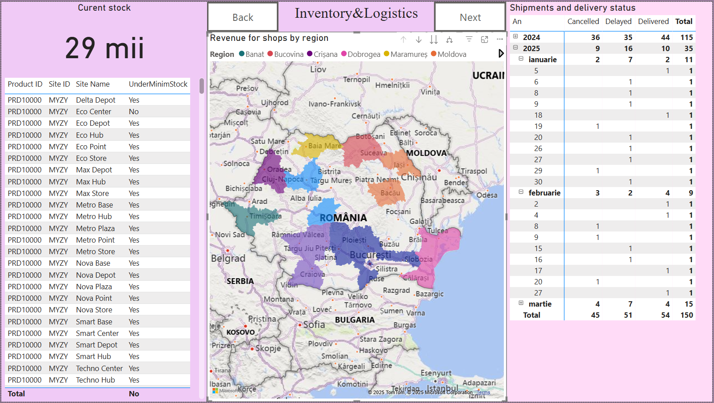

# Power BI Sales & Logistics Dashboard

  

  <em>Created using Canva AI tools. I do not claim ownership of the visual elements. 
  If this image presents an issue, please feel free to contact me.</em>

## Overview

This project demonstrates how to integrate **Microsoft Dynamics 365 Business Central** with **Power BI** to visualize and analyze business data in an interactive and efficient way. Since Business Central lacks advanced visual analysis tools, Power BI was used to bridge that gap, offering dynamic dashboards for better decision-making.

---

## Data Source

Data for this project was simulated using modified **CSV files from Kaggle**, covering the following domains:
- Customer demographics
- Inventory
- Shipping
- Products
- Promotions and discounts
- Sales
- Website activity

Data was localized for Romania (original data was for India) to reflect regional information in charts like maps.

---

## Preprocessing with Python

A preprocessing pipeline was developed using **Python and Pandas** to:
- Eliminate null values
- Remove duplicates
- Verify the data integrity before importing into Power BI

Filtered data was saved to a new folder and flagged if any issues remained.

---

## Power BI Dashboard Structure

CSV data was imported and modeled in Power BI using relationships between entities (via primary keys). Several dashboards were created:

### 1. **Overview Dashboard**
- KPIs: Total revenue, number of customers, number of sales
- Visuals: Card charts, line charts, bar charts
- Purpose: Monitor financial performance and identify trends
- DAX usage: `DISTINCTCOUNT`, `ALLSELECTED` for city-specific customer counts

### 2. **Clients & Promotions**
- Visuals: Pie chart (gender), ring chart (age), scatter plot (customer revenue), bar chart (promotions)
- DAX: Custom metrics for filtering and linking promotions with revenue
- Insight: Relationship between customer demographics, purchases, and applied discounts

### 3. **Inventory & Logistics**
- Visuals: Map (store location by region), matrix (order status), table (inventory levels)
- DAX: Conditions to identify understocked products (< 100 units)
- Purpose: Connect supply chain data with revenue and logistic decisions

### 4. **Sales & Products**
- Visuals: Line chart (actual vs estimated sales), funnel chart (gross margin), treemaps
- DAX: `SUMX`, `unit margin`, `TotalMargin` for profit analysis
- Focus: Understand sales estimation accuracy, supplier efficiency, and discount impact

## Screenshots

#Cover Page
:---------------------------------------------------------------------:

Overview Dashboard | Clients & Promotions | Inventory & Logistics | Sales & Products
:------------------:|:-----------:|:--------------:|:-----------------:
 |  |  |  

---

## Navigation Features

- Buttons for **page navigation** and **return to main menu**
- Makes user interaction intuitive for employees accessing specific dashboards

---

## Tools & Technologies
- Power BI
- Microsoft Dynamics 365 Business Central (data origin simulation)
- Python (Pandas for data cleansing)
- DAX (Data Analysis Expressions) for calculated columns and measures

---

## Author

**mariazorila4**
